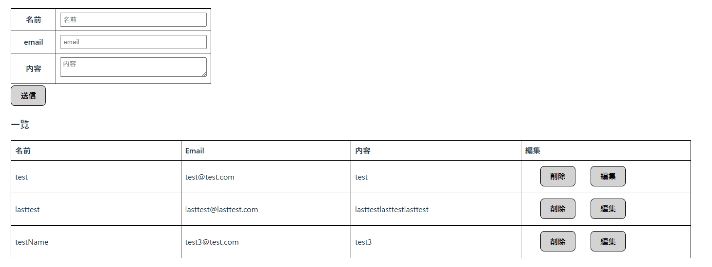
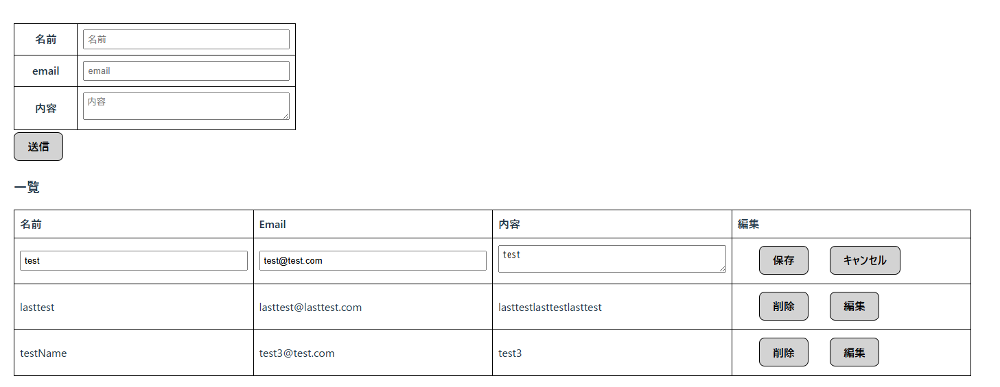

# Contact Form App (React + Spring Boot)

このシステムは、React + Spring Bootを使用した簡易リスト管理アプリケーションです。  
フロントエンドはReact + TypeScript、バックエンドはSpring BootでRESTful APIを構築し、CRUD処理を実装しています。

---

## 🌐 デモ（※準備中）
https://react-portfolio-suica1229.s3.ap-northeast-1.amazonaws.com/index.html

---

## 🛠️ 使用技術
### バックエンド
- Spring Boot v3.x
- Spring Data JPA
- MySQL（JPAでの永続化）
- CORS設定済み（Reactと接続）
- 3層アーキテクチャ（Controller / Service / Repository）

---

## ✅ 実装機能（CRUD対応）

| 機能         | HTTPメソッド | エンドポイント         |
|--------------|--------------|--------------------------|
| リスト取得     | GET          | `/api/get`              |
| 新規登録       | POST         | `/api/save`             |
| 編集（更新）   | PUT          | `/api/update/{id}`      |
| 削除           | DELETE       | `/api/delete/{id}`      |

---

## 💡 工夫したポイント

- 一覧表示と編集モードの切り替えを `editFlg` で制御
- axios / fetch の両方を試し、非同期通信の挙動を比較
- React側は小規模ながらコンポーネント分割し、状態管理も明示的に記述
- Spring Bootでは3層アーキテクチャを採用し、責務分離を意識

---

## スクリーンショット



### システム構成図(Mermaid)
```mermaid
graph TD
  A[React Frontend] --> |axios/fetch|  B[API Gateway]
  B --> C[Spring Boot API]
  C --> D[(MySQL Database)]
```

## 🚀 セットアップ手順（ローカル）
CLI
./gradlew bootrun

IDE
DemoApplication.java
を右クリックして[RUN JAVA]選択

application.propertiesの設定
spring.datasource.url=jdbc:mysql://localhost:3306/contact_db
spring.datasource.username=root
spring.datasource.password=password
spring.jpa.hibernate.ddl-auto=update